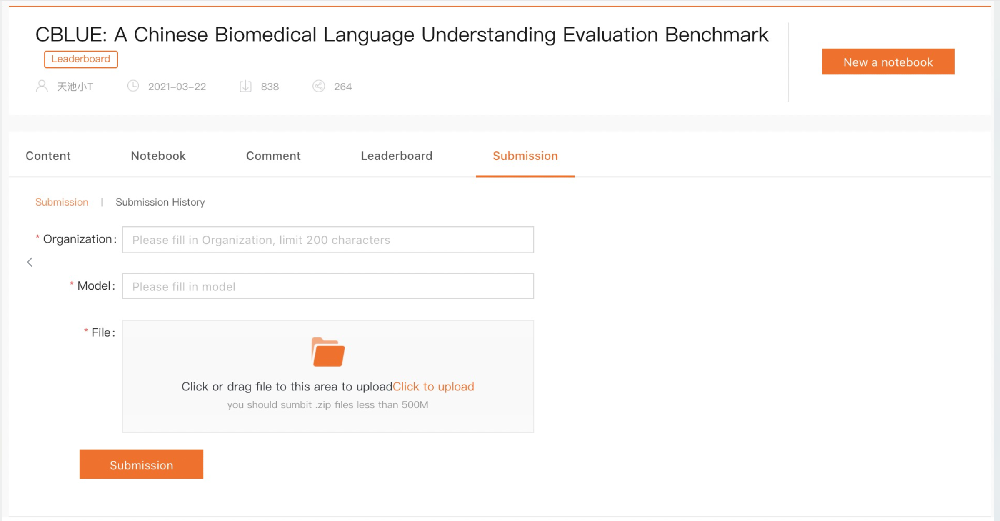

[**English**](https://github.com/CBLUEbenchmark/CBLUE) | [**中文说明**](https://github.com/CBLUEbenchmark/CBLUE/blob/main/README_ZH.md) 

<p align="center"></p>

# CBLUE

[](https://github.com/CBLUEbenchmark/CBLUE/blob/master/LICENSE)
[](https://github.com/CBLUEbenchmark/CBLUE/stargazers)
 

AI (Artificial Intelligence) plays an indispensable role in the biomedical field, helping improve medical technology. For further accelerating AI research in the biomedical field, we present **Chinese Biomedical Language Understanding Evaluation** (CBLUE), including datasets collected from real-world biomedical scenarios, baseline models,  and an online platform for model evaluation, comparison, and analysis.

## CBLUE Benchmark

We evaluate the current 11 Chinese pre-trained models on the eight biomedical language understanding tasks and report the baselines of these tasks.

| Model                                                        |  CMedEE  | CMedIE |   CDN    |   CTC    |   STS    |   QIC    |   QTR    |   QQR    | Avg. |
| ------------------------------------------------------------ | :------: | :----: | :------: | :------: | :------: | :------: | :------: | :------: | :--: |
| [BERT-base](https://github.com/ymcui/Chinese-BERT-wwm)       |   62.1   |  54.0  |   55.4   |   69.2   |   83.0   |   84.3   |   60.0   | **84.7** | 69.0 |
| [BERT-wwm-ext-base](https://github.com/ymcui/Chinese-BERT-wwm) |   61.7   |  54.0  |   55.4   |   70.1   |   83.9   |   84.5   |   60.9   |   84.4   | 69.4 |
| [ALBERT-tiny](https://github.com/brightmart/albert_zh)       |   50.5   |  35.9  |   50.2   |   61.0   |   79.7   |   75.8   |   55.5   |   79.8   | 61.1 |
| [ALBERT-xxlarge](https://huggingface.co/voidful/albert_chinese_xxlarge) |   61.8   |  47.6  |   37.5   |   66.9   |   84.8   |   84.8   |   62.2   |   83.1   | 66.1 |
| [RoBERTa-large](https://github.com/brightmart/roberta_zh)    |   62.1   |  54.4  |   56.5   | **70.9** |   84.7   |   84.2   |   60.9   |   82.9   | 69.6 |
| [RoBERTa-wwm-ext-base](https://github.com/ymcui/Chinese-BERT-wwm) |   62.4   |  53.7  |   56.4   |   69.4   |   83.7   | **85.5** |   60.3   |   82.7   | 69.3 |
| [RoBERTa-wwm-ext-large](https://github.com/ymcui/Chinese-BERT-wwm) |   61.8   |  55.9  |   55.7   |   69.0   |   85.2   |   85.3   |   62.8   |   84.4   | 70.0 |
| [PCL-MedBERT](https://code.ihub.org.cn/projects/1775)        |   60.6   |  49.1  |   55.8   |   67.8   |   83.8   |   84.3   |   59.3   |   82.5   | 67.9 |
| [ZEN](https://github.com/sinovation/ZEN)                     |   61.0   |  50.1  |   57.8   |   68.6   |   83.5   |   83.2   |   60.3   |   83.0   | 68.4 |
| [MacBERT-base](https://huggingface.co/hfl/chinese-macbert-base) |   60.7   |  53.2  |   57.7   |   67.7   |   84.4   |   84.9   |   59.7   |   84.0   | 69.0 |
| [MacBERT-large](https://huggingface.co/hfl/chinese-macbert-large) | **62.4** |  51.6  | **59.3** |   68.6   | **85.6** |   82.7   | **62.9** |   83.5   | 69.6 |
| Human                                                        |   67.0   |  66.0  |   65.0   |   78.0   |   93.0   |   88.0   |   71.0   |   89.0   | 77.1 |

## Baseline of tasks

We present the baseline models on the biomedical tasks and release corresponding codes for a quick start.

### Requirements

python3 / pytorch 1.7 / transformers 4.5.1 / jieba / gensim / sklearn

### Data preparation

[Download dataset](https://tianchi.aliyun.com/dataset/dataDetail?dataId=95414)

The whole zip package includes the datasets of  8 biomedical NLU tasks (more detail in the following section). Every task includes the following files:

```text
├── {Task}
|  └── {Task}_train.json
|  └── {Task}_test.json
|  └── {Task}_dev.json
|  └── example_gold.json
|  └── example_pred.json
|  └── README.md
```

**Notice: a few tasks have additional files, e.g. it includes 'category.xlsx' file in the CHIP-CTC task.** 

You can download Chinese pre-trained models according to your need (download URLs are provided above). With [Huggingface-Transformers](https://huggingface.co/) , the models above could be easily accessed and loaded.

The reference directory:

```text
├── CBLUE         
|  └── baselines
|     └── run_classifier.py
|     └── ...
|  └── examples
|     └── run_qqr.sh
|     └── ...
|  └── cblue
|  └── CBLUEDatasets
|     └── KUAKE-QQR
|     └── ...
|  └── data
|     └── output
|     └── model_data
|        └── bert-base
|        └── ...
|     └── result_output
|        └── KUAKE-QQR_test.json
|        └── ...
```

### Running examples

The shell files of training and evaluation for every task are provided in `examples/` , and could directly run.

Also, you can utilize the running codes in `baselines/` , and write your shell files according to your need:

- `baselines/run_classifer.py`: support `{sts, qqr, qtr, qic, ctc, ee}` tasks;
- `baselines/run_cdn.py`: support `{cdn}` task;
- `baselines/run_ie.py`: support `{ie}` task.

#### Training models

Running shell files: `bash examples/run_{task}.sh`, and the contents of shell files are as follow:

```shell
DATA_DIR="CBLUEDatasets"

TASK_NAME="qqr"
MODEL_TYPE="bert"
MODEL_DIR="data/model_data"
MODEL_NAME="chinese-bert-wwm"
OUTPUT_DIR="data/output"
RESULT_OUTPUT_DIR="data/result_output"

MAX_LENGTH=128

python baselines/run_classifier.py \
    --data_dir=${DATA_DIR} \
    --model_type=${MODEL_TYPE} \
    --model_dir=${MODEL_DIR} \
    --model_name=${MODEL_NAME} \
    --task_name=${TASK_NAME} \
    --output_dir=${OUTPUT_DIR} \
    --result_output_dir=${RESULT_OUTPUT_DIR} \
    --do_train \
    --max_length=${MAX_LENGTH} \
    --train_batch_size=16 \
    --eval_batch_size=16 \
    --learning_rate=3e-5 \
    --epochs=3 \
    --warmup_proportion=0.1 \
    --earlystop_patience=3 \
    --logging_steps=250 \
    --save_steps=250 \
    --seed=2021
```

**Notice: the best checkpoint is saved in** `OUTPUT_DIR/MODEL_NAME/`.

- `MODEL_TYPE`: support `{bert, roberta, albert, zen}` model types;
- `MODEL_NAME`: support `{bert-base, bert-wwm-ext, albert-tiny, albert-xxlarge, zen, pcl-medbert, roberta-large, roberta-wwm-ext-base, roberta-wwm-ext-large, macbert-base, macbert-large}` Chinese pre-trained models.

The `MODEL_TYPE`-`MODEL_NAME` mappings are listed below.

| MODEL_TYPE | MODEL_NAME                                                   |
| :--------: | :----------------------------------------------------------- |
|   `bert`   | `bert-base`, `bert-wwm-ext`, `pcl-medbert`, `macbert-base`, `macbert-large` |
| `roberta`  | `roberta-large`, `roberta-wwm-ext-base`, `roberta-wwm-ext-large` |
|  `albert`  | `albert-tiny`, `albert-xxlarge`                              |
|   `zen`    | `zen`                                                        |

#### Inference & generation of results

Running shell files: `base examples/run_{task}.sh predict`, and the contents of shell files are as follows:

```shell
DATA_DIR="CBLUEDatasets"

TASK_NAME="qqr"
MODEL_TYPE="bert"
MODEL_DIR="data/model_data"
MODEL_NAME="chinese-bert-wwm"
OUTPUT_DIR="data/output"
RESULT_OUTPUT_DIR="data/result_output"

MAX_LENGTH=128

python baselines/run_classifier.py \
    --data_dir=${DATA_DIR} \
    --model_type=${MODEL_TYPE} \
    --model_name=${MODEL_NAME} \
    --model_dir=${MODEL_DIR} \
    --task_name=${TASK_NAME} \
    --output_dir=${OUTPUT_DIR} \
    --result_output_dir=${RESULT_OUTPUT_DIR} \
    --do_predict \
    --max_length=${MAX_LENGTH} \
    --eval_batch_size=16 \
    --seed=2021
```

**Notice: the result of prediction** `{TASK_NAME}_test.json` **will be generated in** `RESULT_OUTPUT_DIR` .

### Submit results

Compressing `RESULT_OUTPUT_DIR` as `.zip` file and submitting the file, you will get the score of evaluation on these biomedical NLU tasks, and your ranking! 

[Submit your results!](https://tianchi.aliyun.com/dataset/dataDetail?dataId=95414)




## Introduction of tasks

For promoting the development and the application of language model in the biomedical field, we collect data from real-world biomedical scenarios and release the eight biomedical NLU (natural language understanding) tasks, including **information extraction from the medical text** (named entity recognition, relation extraction), **normalization of the medical term**, **medical text classification**, **medical sentence similarity estimation** and **medical QA**. 

| Dataset   | Task                    | Train  | Dev   | Test   | Evaluation Metrics |
| --------- | ----------------------- | ------ | ----- | ------ | ------------------ |
| CMeEE     | NER                     | 15,000 | 5,000 | 3,000  | Micro F1           |
| CMeIE     | Relation Extraction     | 14,339 | 3,585 | 4,482  | Micro F1           |
| CHIP-CDN  | Diagnosis Normalization | 6,000  | 2,000 | 10,192 | Micro F1           |
| CHIP-STS  | Sentence Similarity     | 16,000 | 4,000 | 10,000 | Macro F1           |
| CHIP-CTC  | Sentence Classification | 22,962 | 7,682 | 10,000 | Macro F1           |
| KUAKE-QIC | Sentence Classification | 6,931  | 1,955 | 1,944  | Accuracy           |
| KUAKE-QTR | NLI                     | 24,174 | 2,913 | 5,465  | Accuracy           |
| KUAKE-QQR | NLI                     | 15,000 | 1,600 | 1,596  | Accuracy           |

### CMeEE

The evaluation task is the recognition of the named entity on the medical text. Given schema data and medical sentences, models are expected to extract entity about clinical information and classify these entities exactly. 

<details>
<summary>example</summary>
{  
  "text": "呼吸肌麻痹和呼吸中枢受累患者因呼吸不畅可并发肺炎、肺不张等。", 
  "entities": [ 
    { 
      "start_idx": 0, 
      "end_idx": 2, 
      "type": "bod", 
      "entity: "呼吸肌" 
    }, 
    { 
      "start_idx": 0, 
      "end_idx": 4, 
      "type": "sym",
       "entity: "呼吸肌麻痹" 
     }, 
     { 
       "start_idx": 6, 
       "end_idx": 9,
       "type": "bod", 
       "entity: "呼吸中枢"
     }, 
     { 
       "start_idx": 6, 
       "end_idx": 11, 
       "type": "sym", 
       "entity: "呼吸中枢受累" 
   }, 
   { 
      "start_idx": 15, 
      "end_idx": 18, 
      "type": "sym", 
      "entity: "呼吸不畅" 
    }, 
   { 
      "start_idx": 22, 
      "end_idx": 23, 
      "type": "dis", 
      "entity: "肺炎" 
    }, 
   { 
      "start_idx": 25, 
      "end_idx": 27, 
      "type": "dis", 
      "entity: "肺不张" 
    } 
  ] 
}
</details>

### CMeIE

The evaluation task is the extraction of entity relation on the medical text. Given schema and medical sentences, models are expected to automatically extract triples=[(S1, P1, O1), (S2, P2, O2)…] satisfying the constraint of schema. The schema defines the category of the predicate and corresponding subject and object, e.g.

（“subject_type”:“疾病”，“predicate”: “药物治疗”，“object_type”:“药物”）
（“subject_type”:“疾病”，“predicate”: “实验室检查”，“object_type”:“检查”）

<details>
<summary>example</summary>
{  
  "text": "慢性胰腺炎@ ###低剂量放射 自1964年起，有几项病例系列报道称外照射 (5-50Gy) 可以有效改善慢性胰腺炎患者的疼痛症状。慢性胰腺炎@从概念上讲，外照射可以起到抗炎和止痛作用，并且已经开始被用于非肿瘤性疼痛的治疗。", 
  "spo_list": [ 
    { 
      "Combined": true, 
      "predicate": "放射治疗", 
      "subject": "慢性胰腺炎", 
      "subject_type": "疾病", 
      "object": { "@value": "外照射" }, 
      "object_type": { "@value": "其他治疗" } 
    }, 
    { 
      "Combined": true, 
      "predicate": "放射治疗", 
      "subject": "非肿瘤性疼痛", 
      "subject_type": "疾病", 
      "object": { "@value": "外照射" }, 
      "object_type": { "@value": "其他治疗" } 
      }
    }
  ] 
}
</details>


### CHIP-CDN

The evaluation task is the normalization of the diagnosis entity from the Chinese medical record. Given a diagnosis entity,  models are expected to return corresponding standard terms.

<details>
<summary>example</summary>
[
  {
    "text": "左膝退变伴游离体",
    "normalized_result": "膝骨关节病##膝关节游离体"
  },
  {
    "text": "糖尿病反复低血糖;骨质疏松;高血压冠心病不稳定心绞痛",
    "normalized_result": "糖尿病性低血糖症##骨质疏松##高血压##冠状动脉粥样硬化性心脏病##不稳定性心绞痛"
  },
  {
    "text": "右乳腺癌IV期",
    "normalized_result": "乳腺恶性肿瘤##癌"
  }
]
</details>


### CHIP-CTC

In this evaluation task, given 44 semantic categories of screening standard (more detail in `category.xlsx`) and some description about Chinese clinical screening standard, models are expected to return every description's specific category.

<details>
<summary>example</summary>
[
  {
    "id": "s1",
    "label": "Multiple",
    "text": " 7.凝血功能异常（INR＞1.5 或凝血酶原时间（PT）＞ULN+4 秒或 APTT &gt;1.5 ULN），具有出血倾向或正在接受溶栓或抗凝治疗；"
  },
  {
    "id": "s2",
    "label": "Addictive Behavior",
    "text": " （2）重度吸烟（大于10支/天）及酗酒患者"
  },
  {
    "id": "s3",
    "label": "Therapy or Surgery",
    "text": " 13. 有器官移植病史或正等待器官移植的患者；"
  }
]
</details>


### CHIP-STS

In this evaluation task, given pairs of sentences involving five different diseases, models are expected to judge the semantic similarity of the pair of sentences.

<details>
<summary>example</summary>
[
  {
    "id": "1",
    "text1": "糖尿病能吃减肥药吗？能治愈吗？",
    "text2": "糖尿病为什么不能吃减肥药",
    "label": "1",
    "category": "diabetes"
  },
  {
    "id": "2",
    "text1": "有糖尿病和前列腺怎么保健怎样治疗",
    "text2": "患有糖尿病和前列腺怎么办？",
    "label": "1",
    "category": "diabetes"
  },
  {
    "id": "3",
    "text1": "我也是乙肝携带患者，可以办健康证吗在",
    "text2": "乙肝五项化验单怎么看呢",
    "label": "0",
    "category": "hepatitis"
  }
]
</details>


### KUAKE-QIC

In this evaluation task, given a medical query, models are expected to classify the intention of patients. These medical queries have 11 categories: `diagnosis`, `cause`, `method`, `advice`, `metric explain`, `disease expression`, `result`, `attention`, `effect`, `price`, `other`.

<details>
<summary>example</summary>
[
  {
    "id": "s1",
    "query": "心肌缺血如何治疗与调养呢？",
    "label": "治疗方案"
  },
  {
    "id": "s2",
    "query": "19号来的月经，25号服用了紧急避孕药本月5号，怎么办？",
    "label": "治疗方案"
  },
  {
    "id": "s3",
    "query": "什么叫痔核脱出？什么叫外痔？",
    "label": "疾病表述"
  }
]
</details>


### KUAKE-QTR

In this evaluation task, given a pair of query and title, models are expected to predict whether the topic of the pair query and title is consistent and the extent of their consistency. 

<details>
<summary>example</summary>
[
  {
    "id": "s1",
    "query": "咳嗽到腹肌疼",
    "title": "感冒咳嗽引起的腹肌疼痛，是怎么回事？",
    "label": "2"
  },
  {
    "id": "s2",
    "query": "烂牙神经的药对怀孕胚胎",
    "title": "怀孕两个月治疗牙齿烂牙神经用了含砷失活剂 怀孕两个月治疗...",
    "label": "1"
  },
  {
    "id": "s3",
    "query": "怀孕可以空腹吃葡萄吗",
    "title": "怀孕四个月，今早空腹吃了葡萄，然后肚子就一直胀胀的...",
    "label": "1"
  }
]
</details>


### KUAKE-QQR

In this evaluation task, given a pair of queries, models are expected to predict the extent of similarity between them.

<details>
<summary>example</summary>
[
  {
    "id": "s1",
    "query": "小孩子打呼噜什么原因",
    "title": "孩子打呼噜是什么原因",
    "label": "2"
  },
  {
    "id": "s2",
    "query": "小孩子打呼噜什么原因",
    "title": "宝宝打呼噜是什么原因",
    "label": "0"
  },
  {
    "id": "s3",
    "query": "小孩子打呼噜什么原因",
    "title": "小儿打呼噜是什么原因引起的",
    "label": "2"
  }
]
</details>


## Quick start

The modules of `Data Processor`, `Model trainer` could be found in `cblue/`. You can easily construct your code, train and evaluate your own models and methods. The corresponding  `Data Processor`, `Dataset`, `Trainer` of eight tasks are listed below:

| Task      | Data Processor (cblue.data)         | Dataset (cblue.data)    | Trainer (cblue.trainer)               |
| --------- | ----------------------------------- | ----------------------- | ------------------------------------- |
| CMeEE     | `EEDataProcessor`                   | `EEDataset`             | `EETrainer`                           |
| CMeIE     | `ERDataProcessor`/`REDataProcessor` | `ERDataset`/`REDataset` | `ERTrainer`/`RETrainer`               |
| CHIP-CDN  | `CDNDataProcessor`                  | `CDNDataset`            | `CDNForCLSTrainer`/`CDNForNUMTrainer` |
| CHIP-CTC  | `CTCDataProcessor`                  | `CTCDataset`            | `CTCTrainer`                          |
| CHIP-STS  | `STSDataProcessor`                  | `STSDataset`            | `STSTrainer`                          |
| KUAKE-QIC | `QICDataProcessor`                  | `QICDataset`            | `QICTrainer`                          |
| KUAKE-QQR | `QQRDataProcessor`                  | `QQRDataset`            | `QQRTrainer`                          |
| KUAKE-QTR | `QTRDataProcessor`                  | `QTRDataset`            | `QTRTrainer`                          |

**Example for CMeEE**

```python
from cblue.data import EEDataProcessor, EEDataset
from cblue.trainer import EETrainer
from cblue.metrics import ee_metric, ee_commit_prediction

# get samples
data_processor = EEDataProcessor(root=...)
train_samples = data_processor.get_train_sample()
eval_samples = data_processor.get_dev_sample()
test_samples = data_processor,get_test_sample()

# 'torch.Dataset'
train_dataset = EEDataset(train_sample, tokenizer=..., mode='train', max_length=...)

# training model
trainer = EETrainer(...)
trainer.train(...)

# predicton and generation of result
test_dataset = EEDataset(test_sample, tokenizer=..., mode='test', max_length=...)
trainer.predict(test_dataset)
```

## Training setup

We list the hyper-parameters of every tasks during the baseline experiments.

**Common hyper-parameters**

|       Param       | Value |
| :---------------: | :---: |
| warmup_proportion |  0.1  |
|   weight_decay    | 0.01  |
|   adam_epsilon    | 1e-8  |
|   max_grad_norm   |  1.0  |

**CMeEE**

Hyper-parameters for the training of pre-trained models with a token classification head on top for named entity recognition of the CMeEE task.

| Model                 | epoch | batch_size | max_length | learning_rate |
| --------------------- | :---: | :--------: | :--------: | :-----------: |
| bert-base             |   5   |     32     |    128     |     4e-5      |
| bert-wwm-ext          |   5   |     32     |    128     |     4e-5      |
| roberta-wwm-ext       |   5   |     32     |    128     |     4e-5      |
| roberta-wwm-ext-large |   5   |     12     |     65     |     2e-5      |
| roberta-large         |   5   |     12     |     65     |     2e-5      |
| albert-tiny           |  10   |     32     |    128     |     5e-5      |
| albert-xxlarge        |   5   |     12     |     65     |     1e-5      |
| zen                   |   5   |     20     |    128     |     4e-5      |
| macbert-base          |   5   |     32     |    128     |     4e-5      |
| macbert-large         |   5   |     12     |     80     |     2e-5      |
| PCL-MedBERT           |   5   |     32     |    128     |     4e-5      |

**CMeIE-ER**

Hyper-parameters for the training of pre-trained models with a token-level classifier for subject and object recognition of the CMeIE task.

| Model                 | epoch | batch_size | max_length | learning_rate |
| --------------------- | :---: | :--------: | :--------: | :-----------: |
| bert-base             |   7   |     32     |    128     |     5e-5      |
| bert-wwm-ext          |   7   |     32     |    128     |     5e-5      |
| roberta-wwm-ext       |   7   |     32     |    128     |     4e-5      |
| roberta-wwm-ext-large |   7   |     16     |     80     |     4e-5      |
| roberta-large         |   7   |     16     |     80     |     2e-5      |
| albert-tiny           |  10   |     32     |    128     |     4e-5      |
| albert-xxlarge        |   7   |     16     |     80     |     1e-5      |
| zen                   |   7   |     20     |    128     |     4e-5      |
| macbert-base          |   7   |     32     |    128     |     4e-5      |
| macbert-large         |   7   |     20     |     80     |     2e-5      |
| PCL-MedBERT           |   7   |     32     |    128     |     4e-5      |

**CMeIE-RE**

Hyper-parameters for the training of pre-trained models with a classifier for the entity pairs relation prediction of the CMeIE task.

| Model                 | epoch | batch_size | max_length | learning_rate |
| --------------------- | :---: | :--------: | :--------: | :-----------: |
| bert-base             |   8   |     32     |    128     |     5e-5      |
| bert-wwm-ext          |   8   |     32     |    128     |     5e-5      |
| roberta-wwm-ext       |   8   |     32     |    128     |     4e-5      |
| roberta-wwm-ext-large |   8   |     16     |     80     |     4e-5      |
| roberta-large         |   8   |     16     |     80     |     2e-5      |
| albert-tiny           |  10   |     32     |    128     |     4e-5      |
| albert-xxlarge        |   8   |     16     |     80     |     1e-5      |
| zen                   |   8   |     20     |    128     |     4e-5      |
| macbert-base          |   8   |     32     |    128     |     4e-5      |
| macbert-large         |   8   |     20     |     80     |     2e-5      |
| PCL-MedBERT           |   8   |     32     |    128     |     4e-5      |

**CHIP-CTC**

Hyper-parameters for the training of pre-trained models with a sequence classification head on top for screening criteria classification of the CHIP-CTC task.

| Model                 | epoch | batch_size | max_length | learning_rate |
| --------------------- | :---: | :--------: | :--------: | :-----------: |
| bert-base             |   5   |     32     |    128     |     5e-5      |
| bert-wwm-ext          |   5   |     32     |    128     |     5e-5      |
| roberta-wwm-ext       |   5   |     32     |    128     |     4e-5      |
| roberta-wwm-ext-large |   5   |     32     |     50     |     3e-5      |
| roberta-large         |   5   |     24     |     50     |     2e-5      |
| albert-tiny           |  10   |     32     |    128     |     4e-5      |
| albert-xxlarge        |   5   |     20     |     50     |     1e-5      |
| zen                   |   5   |     20     |    128     |     4e-5      |
| macbert-base          |   5   |     32     |    128     |     4e-5      |
| macbert-large         |   5   |     20     |     50     |     2e-5      |
| PCL-MedBERT           |   5   |     32     |    128     |     4e-5      |

**CHIP-CDN-cls**

Hyper-parameters for the CHIP-CDN task. We model the CHIP-CDN task with two stages: recall stage and ranking stage. `num_negative_sample` sets the number of negative samples sampled for the training ranking model during the ranking stage. `recall_k` sets the number of candidates recalled in the recall stage.

| Param               | Value |
| ------------------- | ----- |
| recall_k            | 200   |
| num_negative_sample | 5+5(random)    |

Hyper-parameters for the training of pre-trained models with a sequence classifier for the ranking model of the CHIP-CDN task. We encode the pairs of the original term and standard phrase from candidates recalled during the recall stage and then pass the pooled output to the classifier, which predicts the relevance between the original term and standard phrase.


| Model                 | epoch | batch_size | max_length | learning_rate |
| --------------------- | :---: | :--------: | :--------: | :-----------: |
| bert-base             |   3   |     32     |    128     |     4e-5      |
| bert-wwm-ext          |   3   |     32     |    128     |     5e-5      |
| roberta-wwm-ext       |   3   |     32     |    128     |     4e-5      |
| roberta-wwm-ext-large |   3   |     32     |     40     |     4e-5      |
| roberta-large         |   3   |     32     |     40     |     4e-5      |
| albert-tiny           |   3   |     32     |    128     |     4e-5      |
| albert-xxlarge        |   3   |     32     |     40     |     1e-5      |
| zen                   |   3   |     20     |    128     |     4e-5      |
| macbert-base          |   3   |     32     |    128     |     4e-5      |
| macbert-large         |   3   |     32     |     40     |     2e-5      |
| PCL-MedBERT           |   3   |     32     |    128     |     4e-5      |

**CHIP-CDN-num**

Hyper-parameters for the training of pre-trained models with a sequence classifier for the prediction of the number of standard phrases corresponding to the original term in the CHIP-CDN task. We take the prediction results of the model as the number we choose from the most relevant standard phrases, combining with the prediction of the ranking model.

| Model                 | epoch | batch_size | max_length | learning_rate |
| --------------------- | :---: | :--------: | :--------: | :-----------: |
| bert-base             |  20   |     32     |    128     |     4e-5      |
| bert-wwm-ext          |  20   |     32     |    128     |     5e-5      |
| roberta-wwm-ext       |  20   |     32     |    128     |     4e-5      |
| roberta-wwm-ext-large |  20   |     12     |     40     |     4e-5      |
| roberta-large         |  20   |     12     |     40     |     4e-5      |
| albert-tiny           |  20   |     32     |    128     |     4e-5      |
| albert-xxlarge        |  20   |     12     |     40     |     1e-5      |
| zen                   |  20   |     20     |    128     |     4e-5      |
| macbert-base          |  20   |     32     |    128     |     4e-5      |
| macbert-large         |  20   |     12     |     40     |     2e-5      |
| PCL-MedBERT           |  20   |     32     |    128     |     4e-5      |

**CHIP-STS**

Hyper-parameters for the training of pre-trained models with a sequence classifier for sentence similarity predication of the CHIP-STS task.

| Model                 | epoch | batch_size | max_length | learning_rate |
| --------------------- | :---: | :--------: | :--------: | :-----------: |
| bert-base             |   3   |     16     |     40     |     3e-5      |
| bert-wwm-ext          |   3   |     16     |     40     |     3e-5      |
| roberta-wwm-ext       |   3   |     16     |     40     |     4e-5      |
| roberta-wwm-ext-large |   3   |     16     |     40     |     4e-5      |
| roberta-large         |   3   |     16     |     40     |     2e-5      |
| albert-tiny           |   3   |     16     |     40     |     5e-5      |
| albert-xxlarge        |   3   |     16     |     40     |     1e-5      |
| zen                   |   3   |     16     |     40     |     2e-5      |
| macbert-base          |   3   |     16     |     40     |     3e-5      |
| macbert-large         |   3   |     16     |     40     |     3e-5      |
| PCL-MedBERT           |   3   |     16     |     40     |     2e-5      |

**KUAKE-QIC**

Hyper-parameters for the training of pre-trained models with a sequence classifier for query intention prediction of the KUAKE-QIC task.

| Model                 | epoch | batch_size | max_length | learning_rate |
| --------------------- | :---: | :--------: | :--------: | :-----------: |
| bert-base             |   3   |     16     |     50     |     2e-5      |
| bert-wwm-ext          |   3   |     16     |     50     |     2e-5      |
| roberta-wwm-ext       |   3   |     16     |     50     |     2e-5      |
| roberta-wwm-ext-large |   3   |     16     |     50     |     2e-5      |
| roberta-large         |   3   |     16     |     50     |     3e-5      |
| albert-tiny           |   3   |     16     |     50     |     5e-5      |
| albert-xxlarge        |   3   |     16     |     50     |     1e-5      |
| zen                   |   3   |     16     |     50     |     2e-5      |
| macbert-base          |   3   |     16     |     50     |     3e-5      |
| macbert-large         |   3   |     16     |     50     |     2e-5      |
| PCL-MedBERT           |   3   |     16     |     50     |     2e-5      |

**KUAKE-QTR**

Hyper-parameters for the training of pre-trained models with a sequence classifier for query-title pairs relevance prediction of the KUAKE-QTR task.

| Model                 | epoch | batch_size | max_length | learning_rate |
| --------------------- | :---: | :--------: | :--------: | :-----------: |
| bert-base             |   3   |     16     |     40     |     4e-5      |
| bert-wwm-ext          |   3   |     16     |     40     |     2e-5      |
| roberta-wwm-ext       |   3   |     16     |     40     |     3e-5      |
| roberta-wwm-ext-large |   3   |     16     |     40     |     2e-5      |
| roberta-large         |   3   |     16     |     40     |     2e-5      |
| albert-tiny           |   3   |     16     |     40     |     5e-5      |
| albert-xxlarge        |   3   |     16     |     40     |     1e-5      |
| zen                   |   3   |     16     |     40     |     3e-5      |
| macbert-base          |   3   |     16     |     40     |     2e-5      |
| macbert-large         |   3   |     16     |     40     |     2e-5      |
| PCL-MedBERT           |   3   |     16     |     40     |     3e-5      |

**KUAKE-QQR**

Hyper-parameters for the training of pre-trained models with a sequence classifier for query-query pairs relevance prediction of the KUAKE-QQR task.

| Model                 | epoch | batch_size | max_length | learning_rate |
| --------------------- | :---: | :--------: | :--------: | :-----------: |
| bert-base             |   3   |     16     |     30     |     3e-5      |
| bert-wwm-ext          |   3   |     16     |     30     |     3e-5      |
| roberta-wwm-ext       |   3   |     16     |     30     |     3e-5      |
| roberta-wwm-ext-large |   3   |     16     |     30     |     3e-5      |
| roberta-large         |   3   |     16     |     30     |     2e-5      |
| albert-tiny           |   3   |     16     |     30     |     5e-5      |
| albert-xxlarge        |   3   |     16     |     30     |     3e-5      |
| zen                   |   3   |     16     |     30     |     2e-5      |
| macbert-base          |   3   |     16     |     30     |     2e-5      |
| macbert-large         |   3   |     16     |     30     |     2e-5      |
| PCL-MedBERT           |   3   |     16     |     30     |     2e-5      |

## How to Cite

```bibtex
@article{zhang2021cblue,
title={CBLUE: A Chinese Biomedical Language Understanding Evaluation Benchmark},
author={Ningyu Zhang and Mosha Chen and Zhen Bi and Xiaozhuan Liang and Lei Li and Xin Shang and Kangping Yin and Chuanqi Tan and Jian Xu and Fei Huang and Luo Si and Yuan Ni and Guotong Xie and Zhifang Sui and Baobao Chang and Hui Zong and Zheng Yuan and Linfeng Li and Jun Yan and Hongying Zan and Kunli Zhang and Buzhou Tang and Qingcai Chen},
journal={arXiv preprint arXiv:2106.08087},
year={2021}
}
```

## References
[1] CLUE: A Chinese Language Understanding Evaluation Benchmark [[pdf]](https://arxiv.org/abs/2004.05986) [[git]](https://github.com/CLUEbenchmark/CLUE) [[web]](http://www.cluebenchmarks.com/)

[2] GLUE: A Multi-Task Benchmark and Analysis Platform for Natural Language Understanding [[pdf]](https://openreview.net/pdf?id=rJ4km2R5t7) [[web]](https://gluebenchmark.com/)

[3] SuperGLUE: A Stickier Benchmark for General-Purpose Language Understanding Systems [[pdf]](https://w4ngatang.github.io/static/papers/superglue.pdf) [[web]](https://super.gluebenchmark.com/)

