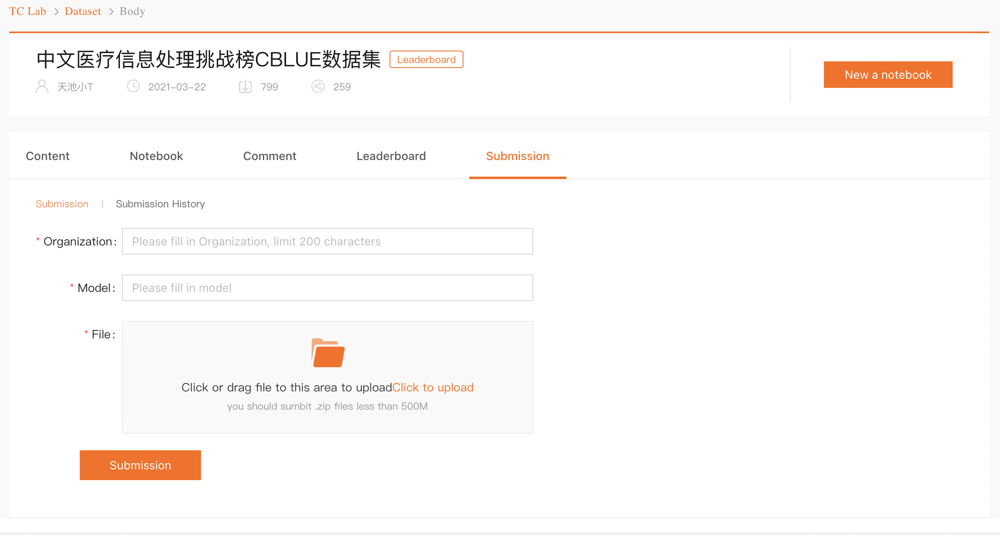

# CBLUE

在医疗领域，人工智能开始发挥其作用，助力医疗技术水平提高。为了进一步促进AI+医疗的研究进展，我们发布了中文医学语言理解测评（CBLUE），包括数据集、基准模型、排行榜。

## 测评基准（CBLUE Benchmark）

在8个中文医疗语言理解任务上，我们实验了8个中文预训练模型，确定了任务的基线。


| Model                                                        |  CMedEE  | CMedIE | CDN  |   CTC    |   STS    |   QIC    |   QTR    |   QQR    | Avg. |
| ------------------------------------------------------------ | :------: | :----: | :--: | :------: | :------: | :------: | :------: | :------: | :--: |
| [BERT-base](https://github.com/ymcui/Chinese-BERT-wwm)       |   62.1   |  54.0  | 55.4 |   69.2   |   83.0   |   84.3   |   60.0   | **84.7** |      |
| [BERT-wwm-ext-base](https://github.com/ymcui/Chinese-BERT-wwm) |   61.7   |  54.0  | 55.4 |   70.1   |   83.9   |   84.5   |   60.9   |   84.4   |      |
| [ALBERT-tiny](https://github.com/brightmart/albert_zh)       |   50.5   |  30.4  | 50.2 |   45.4   |   79.7   |   75.8   |   55.5   |   79.8   |      |
| [ALBERT-xxlarge](https://huggingface.co/voidful/albert_chinese_xxlarge) |   61.8   |        |      |   58.6   |   84.8   |   84.8   |   62.2   |   83.1   |      |
| [RoBERTa-large](https://github.com/brightmart/roberta_zh)    |   62.1   |  54.4  | 56.5 | **70.9** |   84.7   |   84.2   |   60.9   |   82.9   |      |
| [RoBERTa-wwm-ext-base](https://github.com/ymcui/Chinese-BERT-wwm) | **62.4** |  53.7  | 56.4 |   69.4   |   83.7   | **85.5** |   60.3   |   82.7   |      |
| [RoBERTa-wwm-ext-large](https://github.com/ymcui/Chinese-BERT-wwm) |   61.8   |  55.9  | 55.7 |   69.0   | **85.2** |   85.3   | **62.8** |   84.4   |      |
| [PCL-MedBERT](https://code.ihub.org.cn/projects/1775)        |   60.6   |  49.1  | 55.8 |   67.8   |   83.8   |   84.3   |   59.3   |   82.5   |      |
| Human                                                        |   63.0   |  63.0  | 61.0 |   74.0   |   90.0   |   81.0   |   67.0   |   87.0   |      |

## 任务基线（Baseline of tasks）

我们开放了8个任务上的基准模型以及相关代码。

#### 运行环境（Requirements）

python3 / pytorch 1.7 / transformers 4.5.1 / jieba / gensim 

#### 数据准备（Data preparation）

[数据下载](https://tianchi.aliyun.com/dataset/dataDetail?dataId=95414)

在正常下载的文件下，包含8个任务的数据集，每个数据集的目录如下：

```text
├── {Task}          # 每个任务的名称
|  └── {Task}_train.json
|  └── {Task}_test.json
|  └── {Task}_dev.json
|  └── example_gold.json
|  └── example_pred.json
|  └── README.md
```

`Note: 个别任务会有附加文件，比如CHIP-CTC任务，有另外的'category.xlsx‘文件。`

可以根据需要下载中文预训练模型（上面提供了下载链接）。

目录参考：

```text
├── CBLUE         
|  └── baselines
|     └── run_classifier.py
|     └── ...
|  └── examples
|     └── run_qqr.sh
|     └── ...
|  └── cblue
|  └── CBLUEDatasets
|     └── KUAKE-QQR
|     └── ...
|  └── data
|     └── output
|     └── model_data
|     	 └── bert-base
|		 └── ...
|     └── result_output
| 		 └── KUAKE-QQR_test.json
|        └── ...
```

#### 运行样例 （Running examples）

我们在 `examples/` 目录下提供了每个任务训练和预测（生成提交结果）的sh脚本文件，可以直接运行。

也可以使用我们提供的 `baselines/` 目录下的运行文件 ，再根据需要编写sh脚本：

- `baselines/run_classifer.py`：支持`{sts, qqr, qtr, sts, ctc, ee}` 任务；
- `baselines/run_cdn.py`：仅支持`{cdn}`任务；
- `baselines/run_ie.py`：仅支持 `{ie}` 任务。

##### 训练模型 （Training models）
直接运行sh脚本文件 `sh examples/run_{task}.sh` ，也可以根据训练测的需要，调整sh脚本文件的内容，其具体内容如下：

```shell
DATA_DIR="CBLUEDatasets"                       # 数据集总目录

TASK_NAME="qqr"                                # 具体任务
MODEL_TYPE="bert"                              # 预训练模型类型
MODEL_DIR="data/model_data"                    # 预训练模型保存路径
MODEL_NAME="chinese-bert-wwm"                  # 预训练模型名称
OUTPUT_DIR="data/output"                       # 模型保存目录
RESULT_OUTPUT_DIR="data/result_output"         # 提交结果保存目录

MAX_LENGTH=128

python baselines/run_classifier.py \
    --data_dir=${DATA_DIR} \
    --model_type=${MODEL_TYPE} \
    --model_dir=${MODEL_DIR} \
    --model_name=${MODEL_NAME} \
    --task_name=${TASK_NAME} \
    --output_dir=${OUTPUT_DIR} \
    --result_output_dir=${RESULT_OUTPUT_DIR} \
    --do_train \
    --max_length=${MAX_LENGTH} \
    --train_batch_size=16 \
    --eval_batch_size=16 \
    --learning_rate=3e-5 \
    --epochs=3 \
    --warmup_proportion=0.1 \
    --earlystop_patience=3 \
    --logging_steps=250 \
    --save_steps=250 \
    --seed=2021
```

`Note：最优模型默认保存在'OUTPUT_DIR/MODEL_NAME/'`。

##### 预测和生成结果（Inference & generation of results）

直接运行sh脚本文件 `sh examples/run_{task}.sh predict`，也可以根据预测的需要，调整sh脚本文件的内容，其具体内容如下：

```shell
DATA_DIR="CBLUEDatasets"                       # 数据集总目录

TASK_NAME="qqr"                                # 具体任务
MODEL_TYPE="bert"                              # 预训练模型类型
MODEL_DIR="data/model_data"                    # 预训练模型保存路径
MODEL_NAME="chinese-bert-wwm"                  # 预训练模型名称
OUTPUT_DIR="data/output"                       # 模型保存目录
RESULT_OUTPUT_DIR="data/result_output"         # 提交结果保存目录

MAX_LENGTH=128

python baselines/run_classifier.py \
    --data_dir=${DATA_DIR} \
    --model_type=${MODEL_TYPE} \
    --model_name=${MODEL_NAME} \
    --model_dir=${MODEL_DIR} \
    --task_name=${TASK_NAME} \
    --output_dir=${OUTPUT_DIR} \
    --result_output_dir=${RESULT_OUTPUT_DIR} \
    --do_predict \
    --max_length=${MAX_LENGTH} \
    --eval_batch_size=16 \
    --seed=2021
```

预测结果 `{task}_test.json` 将生成在 `RESULT_OUTPUT_DIR` 目录下。

##### 提交结果（Commiting results）

将 `RESULT_OUTPUT_DIR` 目录下的结果文件打包成 `.zip` 文件便可提交， [提交结果](https://tianchi.aliyun.com/dataset/dataDetail?dataId=95414) 



## 任务介绍（Introduction of tasks）

为了推动语言模型技术在医疗领域的发展和落地，我们收集整理了真实的医疗数据，并发布了8个医疗语言理解任务，包括医学文本信息抽取（实体识别、关系抽取）、医学术语归一化、医学文本分类、医学句子关系判定和医学QA共5大类任务8个子任务。

| Dataset   | Task                    | Train  | Dev   | Test   | Evaluation Metrics |
| --------- | ----------------------- | ------ | ----- | ------ | ------------------ |
| CMeEE     | NER                     | 15,000 | 5,000 | 3,000  | Micro F1           |
| CMeIE     | Relation Extraction     | 14,339 | 3,585 | 4,482  | Micro F1           |
| CHIP-CDN  | Sentence Similarity     | 6,000  | 2,000 | 10,192 | F1 score           |
| CHIP-STS  | Sentence Similarity     | 16,000 | 4,000 | 10,000 | Macro F1           |
| CHIP-CTC  | Sentence Classification | 22,962 | 7,682 | 10,000 | Macro F1           |
| KUAKE-QIC | Sentence Classification | 6,931  | 1,955 | 1,944  | Accuracy           |
| KUAKE-QTR | NLI                     | 24,174 | 2,913 | 5,465  | Accuracy           |
| KUAKE-QQR | NLI                     | 15,000 | 1,600 | 1,596  | Accuracy           |

#### 中文医学命名实体识别（CMeEE）

本评测任务为面向中文医学文本的命名实体识别，即给定schema及句子sentence，对于给定的一组纯医学文本文档，任务的目标是识别并抽取出与医学临床相关的实体，并将他们归类到预先定义好的类别。将医学文本命名实体划分为九大类，包括：疾病(dis)，临床表现(sym)，药物(dru)，医疗设备(equ)，医疗程序(pro)，身体(bod)，医学检验项目(ite)，微生物类(mic)，科室(dep)。标注之前对文章进行自动分词处理，所有的医学实体均已正确切分。

<details>
<summary>数据样例</summary>
{  
  "text": "呼吸肌麻痹和呼吸中枢受累患者因呼吸不畅可并发肺炎、肺不张等。", 
  "entities": [ 
    { 
      "start_idx": 0, 
      "end_idx": 2, 
      "type": "bod", 
      "entity: "呼吸肌" 
    }, 
    { 
      "start_idx": 0, 
      "end_idx": 4, 
      "type": "sym",
       "entity: "呼吸肌麻痹" 
     }, 
     { 
       "start_idx": 6, 
       "end_idx": 9,
       "type": "bod", 
       "entity: "呼吸中枢"
     }, 
     { 
       "start_idx": 6, 
       "end_idx": 11, 
       "type": "sym", 
       "entity: "呼吸中枢受累" 
   }, 
   { 
      "start_idx": 15, 
      "end_idx": 18, 
      "type": "sym", 
      "entity: "呼吸不畅" 
    }, 
   { 
      "start_idx": 22, 
      "end_idx": 23, 
      "type": "dis", 
      "entity: "肺炎" 
    }, 
   { 
      "start_idx": 25, 
      "end_idx": 27, 
      "type": "dis", 
      "entity: "肺不张" 
    } 
  ] 
}
</details>
#### 中文医学文本实体关系抽取（CMeIE）

本评测任务为面向中文医学文本的实体关系抽取，即给定schema约束集合及句子sentence，其中schema定义了关系Predicate以及其对应的主体Subject和客体Object的类别，例如：
（“subject_type”:“疾病”，“predicate”: “药物治疗”，“object_type”:“药物”）
（“subject_type”:“疾病”，“predicate”: “实验室检查”，“object_type”:“检查”）。
任务要求参评系统自动地对句子进行分析，输出句子中所有满足schema约束的SPO三元组知识Triples=[(S1, P1, O1), (S2, P2, O2)…]。

<details>
<summary>数据样例</summary>
{  
  "text": "慢性胰腺炎@ ###低剂量放射 自1964年起，有几项病例系列报道称外照射 (5-50Gy) 可以有效改善慢性胰腺炎患者的疼痛症状。慢性胰腺炎@从概念上讲，外照射可以起到抗炎和止痛作用，并且已经开始被用于非肿瘤性疼痛的治疗。", 
  "spo_list": [ 
    { 
      "Combined": true, 
      "predicate": "放射治疗", 
      "subject": "慢性胰腺炎", 
      "subject_type": "疾病", 
      "object": { "@value": "外照射" }, 
      "object_type": { "@value": "其他治疗" } 
    }, 
    { 
      "Combined": true, 
      "predicate": "放射治疗", 
      "subject": "非肿瘤性疼痛", 
      "subject_type": "疾病", 
      "object": { "@value": "外照射" }, 
      "object_type": { "@value": "其他治疗" } 
      }
    }
  ] 
}
</details>
#### 临床术语标准化任务（CHIP-CDN）

本评测任务主要目标是针对中文电子病历中挖掘出的真实诊断实体进行语义标准化。 给定一诊断原词，要求给出其对应的诊断标准词。所有诊断原词均来自于真实医疗数据，并以《国际疾病分类 ICD-10 北京临床版v601》词表为标准进行了标注（可能存在多个标准词，用##分隔）。

<details>
<summary>数据样例</summary>
[
  {
    "text": "左膝退变伴游离体",
    "normalized_result": "膝骨关节病##膝关节游离体"
  },
  {
    "text": "糖尿病反复低血糖;骨质疏松;高血压冠心病不稳定心绞痛",
    "normalized_result": "糖尿病性低血糖症##骨质疏松##高血压##冠状动脉粥样硬化性心脏病##不稳定性心绞痛"
  },
  {
    "text": "右乳腺癌IV期",
    "normalized_result": "乳腺恶性肿瘤##癌"
  }
]
</details>
#### 临床试验筛选标准短文本分类（CHIP-CTC）

在本测评任务中，我们给定事先定义好的44种筛选标准语义类别 （详见附件的**category.xlsx** ）和一系列中文临床试验筛选标准的描述句子，任务目标是返回每一条筛选标准的具体类别。

<details>
<summary>数据样例</summary>
[
  {
    "id": "s1",
    "label": "Multiple",
    "text": " 7.凝血功能异常（INR＞1.5 或凝血酶原时间（PT）＞ULN+4 秒或 APTT &gt;1.5 ULN），具有出血倾向或正在接受溶栓或抗凝治疗；"
  },
  {
    "id": "s2",
    "label": "Addictive Behavior",
    "text": " （2）重度吸烟（大于10支/天）及酗酒患者"
  },
  {
    "id": "s3",
    "label": "Therapy or Surgery",
    "text": " 13. 有器官移植病史或正等待器官移植的患者；"
  }
]
</details>
#### 平安医疗科技疾病问答迁移学习（CHIP-STS）

在本测评任务中，给定来自5个不同病种的问句对，要求判定两个句子语义是否相同或者相近。category表示问句对的病种名称，分别对应：diabetes-糖尿病，hypertension-高血压，hepatitis-乙肝，aids-艾滋病，breast_cancer-乳腺癌。label表示问句之间的语义是否相同。若相同，标为1，若不相同，标为0。

<details>
<summary>数据样例</summary>
[
  {
    "id": "1",
    "text1": "糖尿病能吃减肥药吗？能治愈吗？",
    "text2": "糖尿病为什么不能吃减肥药",
    "label": "1",
    "category": "diabetes"
  },
  {
    "id": "2",
    "text1": "有糖尿病和前列腺怎么保健怎样治疗",
    "text2": "患有糖尿病和前列腺怎么办？",
    "label": "1",
    "category": "diabetes"
  },
  {
    "id": "3",
    "text1": "我也是乙肝携带患者，可以办健康证吗在",
    "text2": "乙肝五项化验单怎么看呢",
    "label": "0",
    "category": "hepatitis"
  }
]
</details>
#### 医疗搜索检索词意图分类（KUAKE-QIC）

在本评测任务中，给定医学搜索问题，要求对医学问题进行意图分类。医学问题分为病情诊断(diagnosis）、病因分析(cause)、治疗方案(method)、就医建议(advice)、指标解读(metric_explain)、疾病描述(disease_express)、后果表述(result)、注意事项(attention)、功效作用(effect)、医疗费用(price)、其他(other) 共11种类型。

<details>
<summary>数据样例</summary>
[
  {
    "id": "s1",
    "query": "心肌缺血如何治疗与调养呢？",
    "label": "治疗方案"
  },
  {
    "id": "s2",
    "query": "19号来的月经，25号服用了紧急避孕药本月5号，怎么办？",
    "label": "治疗方案"
  },
  {
    "id": "s3",
    "query": "什么叫痔核脱出？什么叫外痔？",
    "label": "疾病表述"
  }
]
</details>

#### 医疗搜索查询词-页面标题相关性（KUAKE-QTR）

在本测评任务中，给定评估搜索词(Query)表述主题和落地页标题(Title)表述主题，要求判断Query主题和Title主题是否一致及达到多大程度上的一致。

<details>
<summary>数据样例</summary>
[
  {
    "id": "s1",
    "query": "咳嗽到腹肌疼",
    "title": "感冒咳嗽引起的腹肌疼痛，是怎么回事？",
    "label": "2"
  },
  {
    "id": "s2",
    "query": "烂牙神经的药对怀孕胚胎",
    "title": "怀孕两个月治疗牙齿烂牙神经用了含砷失活剂 怀孕两个月治疗...",
    "label": "1"
  },
  {
    "id": "s3",
    "query": "怀孕可以空腹吃葡萄吗",
    "title": "怀孕四个月，今早空腹吃了葡萄，然后肚子就一直胀胀的...",
    "label": "1"
  }
]
</details>

#### 医疗搜索查询词-查询词相关性（KUAKE-QQR）

在本测评任务中，给定两个query，要求评估两个Query所表述主题的匹配程度。

<details>
<summary>数据样例</summary>
[
  {
    "id": "s1",
    "query": "小孩子打呼噜什么原因",
    "title": "孩子打呼噜是什么原因",
    "label": "2"
  },
  {
    "id": "s2",
    "query": "小孩子打呼噜什么原因",
    "title": "宝宝打呼噜是什么原因",
    "label": "0"
  },
  {
    "id": "s3",
    "query": "小孩子打呼噜什么原因",
    "title": "小儿打呼噜是什么原因引起的",
    "label": "2"
  }
]
</details>


## 编写自己的代码（Write own code）

我们同时提供了8个任务的数据处理、模型训练、验证的模块代码，可供快速构建自己的代码。

##### CMeEE

```python
from cblue.data import EEDataProcessor, EEDataset
from cblue.trainer import EETrainer

data_processor = EEDataProcessor(root=...)
# 获取训练样本（已经过数据处理）
train_samples = data_processor.get_train_sample()
# 获取验证样本
eval_samples = data_processor.get_dev_sample()
# 获取测试样本
test_samples = data_processor,get_test_sample()

# 'torch Dataset'
train_dataset = EEDataset(train_sample, tokenizer=..., mode='train', max_length=...)

# trainer
trainer = EETrainer(...)
trainer.train(...)

# 预测
test_dataset = EEDataset(test_sample, tokenizer=..., mode='test', max_length=...)
trainer.predict(test_dataset)
```

##### CMeIE

`Note: 我们的 CMeIE 的 baseline 采用两阶段建模，故两阶段的模块代码拆分为了 'ER...' 和 'RE...'`

```python
from cblue.data import ERDataProcessor, REDataProcessor, REDataset, ERDataset
from cblue.trainer import ERTrainer, RETrainer

# 调用方式同上
```